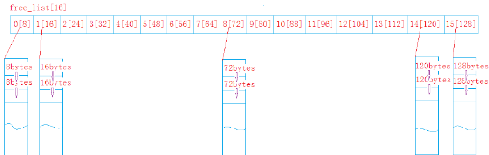
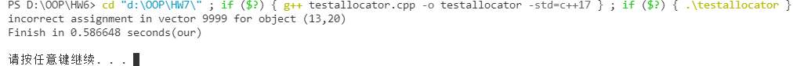
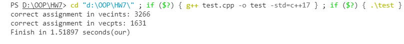

<center> <font color=black size=6> STL allocator + memory pool</font></center>

## 1. 问题描述

STL的容器（如vector）在构造以及使用的过程中需要通过空间配置器（allocator）获取数据存储空间。STL Allocator定义了两级配置器，第一级配置器的实现比较简单，malloc和free就是使用的第一级配置器。但是频繁的使用malloc，free开辟释放小块内存使得性能效率下降，并且内存碎片化，导致不连续内存不可用的浪费。因此我们引入了第二级配置器。本实验实现了一个自己的STL allocator，并且通过memory pool对内存进行管理。

## 2. 数据结构与算法描述

### 2.1 数据结构定义

Myallocator类的定义如下：

```c++
template <typename T, size_t BlockSize = 4096>
class MyAllocator {
public:
	typedef T value_type;
	typedef T* pointer;
	typedef T& reference;
	typedef const T* const_pointer;
	typedef const T& const_reference;
	typedef size_t size_type;			// unsigned long
	typedef ptrdiff_t difference_type;	// long
	typedef true_type propagate_on_container_move_assignment;
	typedef true_type is_always_equal;

	template <typename U> struct rebind {
		typedef MyAllocator<U> other;
	};

    // constructor for MyAllocator
	constexpr MyAllocator() noexcept;
	constexpr MyAllocator(const MyAllocator& myallocator) noexcept;
	MyAllocator(MyAllocator&& myallocator) noexcept;
	template <class U>MyAllocator(const MyAllocator<U>& myallocator) noexcept;

    // destructor for MyAllocator
	~MyAllocator() noexcept;
	
    // overload operator =
	MyAllocator& operator=(const MyAllocator& myallocator) = delete;
	MyAllocator& operator=(MyAllocator&& myallocator) noexcept;

	pointer address(reference x) const noexcept;
	const_pointer address(const_reference x) const noexcept;

	pointer allocate(size_type n, const void* hint = 0);
	constexpr void deallocate(pointer p, size_type n);
	
	size_type max_size() const noexcept;
	
	template <class U, class... Args> void construct(U* p, Args&&... args);
	template <class U> void destroy(U* p);

private:
	union Slot_ {
		union Slot_* next;      // in allocator free list, used as pointer to the next node
        char element[1];  		// store the data when 
	};

    enum {ALIGN = 8};				// pgraded boundaries for small blocks
    enum {MAXBYTE = 128};			// upper bytes limites for small blocks
    enum {NUMBEROFFREELISTS = 16};	// number of freelist

	typedef char* data_pointer_;
	typedef Slot_ slot_type_;
	typedef Slot_* slot_pointer_;

	slot_pointer_ volatile freeLists[NUMBEROFFREELISTS];	// freelists
	data_pointer_ start;	// the start position of the memory pool
	data_pointer_ end;		// the end position of the memory pool
	
	void allocateBlock();
	slot_pointer_ allocateChunk(int idx);
	
	static_assert(BlockSize >= 2 * sizeof(slot_type_), "Blocksize too small.");
};
```

我们采用**自由链表（free list）**对空间进行管理。自由链表是一个指针数组，数组大小为16，类似于hash桶，每个数组元素代表着所挂区块的大小，`free_list[i]`代表着其下面挂的是$8\times(i+1)$byte的区块。如下图所示



此外，我们还有还采用内存池（memory pool）对未被挂在自由链表的区块进行保存，以`start`和 `end`记录其大小。

### 2.2 核心算法分析

我们主要实现的是以下函数

**allocator**函数

函数定义如下：

```c++
template<typename T, size_t BlockSize>
inline typename MyAllocator<T, BlockSize>::pointer MyAllocator<T, BlockSize>::allocate(size_type n, const void* hint) ;
```

该函数根据给定的大小分配内存。如果需要的大小大于128，则使用第一级配置器。如果需要的大小小于128，则取`freelist`中对应大小的数组去找。若该大小有空余内存，则返回指针，若没有，则调用`allocateChunk`函数装填该处的自由链表并且返回。

**allocateChunk**函数

函数定义如下

```c++
template<typename T, size_t BlockSize>
inline typename MyAllocator<T, BlockSize>::slot_pointer_ MyAllocator<T, BlockSize>::allocateChunk(int idx);
```

该函数为对应`freelist[idx]`提供新的内存块。我们默认向内存池中申请20块这么大的内存。

如果内存池中有足够的内存，则直接取出。如果内存池中内存不够20块，但是至少能取出一块，那么将内存最大可分配的块数给`freelist`。如果内存池中连一块的内存都不够，则重新向系统申请内存，申请成功后再分配给`freelist`。

**deallocate**函数

函数定义如下

```c++
template<typename T, size_t BlockSize>
inline constexpr void MyAllocator<T, BlockSize>::deallocate(pointer p, size_type n)
```

该函数释放`p`处的内存。

如果释放的大小大于128，则使用第一级配置器。如果释放的大小小于128，则释放`freelist`中对应的指针。

具体实现见附录的源码。

## 3. 测试

我们分别使用了PTA上的测试以及压缩包中的测试，均可以正确输出，结果如下：

压缩包测试：



PTA测试：



在上传的文件中包含了 windows 下的生成的 `.exe` 执行文件以及 linux 下的 `.out` 类型可执行文件；

全部可执行文件都是采用的 ==**`-std=c++17`**== 下编译的。

## Appendix：Source Code

**myallocator.h**

```c++
#ifndef MY_ALLOCATOR_H
#define MY_ALLOCATOR_H
#include <cstddef>
#include <type_traits>
#include <climits>
#include <utility>
#include <new>

using namespace std;

template <typename T, size_t BlockSize = 4096>
class MyAllocator {
public:
	typedef T value_type;
	typedef T* pointer;
	typedef T& reference;
	typedef const T* const_pointer;
	typedef const T& const_reference;
	typedef size_t size_type;			// unsigned long
	typedef ptrdiff_t difference_type;	// long
	typedef true_type propagate_on_container_move_assignment;
	typedef true_type is_always_equal;

	template <typename U> struct rebind {
		typedef MyAllocator<U> other;
	};

    // constructor for MyAllocator
	constexpr MyAllocator() noexcept;
	constexpr MyAllocator(const MyAllocator& myallocator) noexcept;
	MyAllocator(MyAllocator&& myallocator) noexcept;
	template <class U>MyAllocator(const MyAllocator<U>& myallocator) noexcept;

    // destructor for MyAllocator
	~MyAllocator() noexcept;
	
    // overload operator =
	MyAllocator& operator=(const MyAllocator& myallocator) = delete;
	MyAllocator& operator=(MyAllocator&& myallocator) noexcept;

	pointer address(reference x) const noexcept;
	const_pointer address(const_reference x) const noexcept;

	pointer allocate(size_type n, const void* hint = 0);
	constexpr void deallocate(pointer p, size_type n);
	
	size_type max_size() const noexcept;
	
	template <class U, class... Args> void construct(U* p, Args&&... args);
	template <class U> void destroy(U* p);

private:
	union Slot_ {
		union Slot_* next;      // in allocator free list, used as pointer to the next node
        char element[1];  		// store the data when 
	};

    enum {ALIGN = 8};				// pgraded boundaries for small blocks
    enum {MAXBYTE = 128};			// upper bytes limites for small blocks
    enum {NUMBEROFFREELISTS = 16};	// number of freelist

	typedef char* data_pointer_;
	typedef Slot_ slot_type_;
	typedef Slot_* slot_pointer_;

	slot_pointer_ volatile freeLists[NUMBEROFFREELISTS];	// freelists
	data_pointer_ start;	// the start position of the memory pool
	data_pointer_ end;		// the end position of the memory pool
	
	void allocateBlock();
	slot_pointer_ allocateChunk(int idx);
	
	static_assert(BlockSize >= 2 * sizeof(slot_type_), "Blocksize too small.");
};

//TODO
template<typename T, size_t BlockSize>
constexpr MyAllocator<T, BlockSize>::MyAllocator() noexcept {
	for ( int i = 0; i < NUMBEROFFREELISTS; i++ ) {
		freeLists[i] = nullptr;
    }
	start = nullptr;
	end = nullptr;
}

template<typename T, size_t BlockSize>
constexpr MyAllocator<T, BlockSize>::MyAllocator(const MyAllocator & myallocator) noexcept:MyAllocator() {}

//TODO
template<typename T, size_t BlockSize>
MyAllocator<T, BlockSize>::MyAllocator(MyAllocator && myallocator) noexcept {
	for ( int i = 0; i < NUMBEROFFREELISTS; i++ ) {
		freeLists[i] = myallocator.freeLists[i];
	}
	start = myallocator.start;
	end = myallocator.end;
}

template<typename T, size_t BlockSize>
template <class U>
MyAllocator<T, BlockSize>::MyAllocator(const MyAllocator<U>& myallocator) noexcept:MyAllocator() {}

//TODO
template<typename T, size_t BlockSize>
MyAllocator<T, BlockSize>::~MyAllocator() noexcept {
	for ( int i = 0; i < NUMBEROFFREELISTS; i++ ) {
		freeLists[i] = nullptr;
	}
	start = nullptr;
	end = nullptr;
}

//TODO
template<typename T, size_t BlockSize>
MyAllocator<T, BlockSize> & MyAllocator<T, BlockSize>::operator=(MyAllocator && myallocator) noexcept {
	for ( int i = 0; i < NUMBEROFFREELISTS; i++ ) {
		freeLists[i] = myallocator.freeLists[i];
	}
	start = myallocator.start;
	end = myallocator.end;
}

template<typename T, size_t BlockSize>
inline typename MyAllocator<T, BlockSize>::pointer MyAllocator<T, BlockSize>::address(reference x) const noexcept {
	return &x;
}

template <typename T, size_t BlockSize>
inline typename MyAllocator<T, BlockSize>::const_pointer MyAllocator<T, BlockSize>::address(const_reference x) const noexcept {
	return &x;
}

//TODO
template<typename T, size_t BlockSize>
void MyAllocator<T, BlockSize>::allocateBlock() {
	// Allocate space for the new block and store a pointer to the previous one
	start = reinterpret_cast<data_pointer_>(operator new(BlockSize));
	end = reinterpret_cast<data_pointer_>(start + BlockSize);
}

//TODO
template<typename T, size_t BlockSize>
inline typename MyAllocator<T, BlockSize>::pointer MyAllocator<T, BlockSize>::allocate(size_type n, const void* hint) {
	pointer res = nullptr;
	/* if the required block is larger than 128 bytes, throw an exception */
	if ( n >= max_size() ) {
		throw new std::bad_array_new_length;
	}
	/* find the corresponding free list based on the size of the application space (one of 16 free lists) */
	else {
		size_type bytes = n * sizeof(value_type);
		/* negative size, throw an exception */
		if ( bytes <= 0 ) {
			throw new std::bad_alloc;
		}
		/* need more than 128 bytes, new */
		else if ( bytes > (size_type)MAXBYTE ) {
			res = reinterpret_cast<pointer>(operator new(bytes));
		}
		/* allocate from the freelist */
		else {
			int idx = (bytes-1) / 8;					// find the corresponding freelist[idx]
			/* there is a free block, take it away */
			if ( freeLists[idx] != nullptr ) {
				res = reinterpret_cast<pointer>(freeLists[idx]);
				freeLists[idx] = freeLists[idx]->next;
			}
			/* there is no free block, need fill */
			else {
				res = reinterpret_cast<pointer>(allocateChunk(idx));
			}
		}
	}
	return res;
}

//TODO
template<typename T, size_t BlockSize>
inline typename MyAllocator<T, BlockSize>::slot_pointer_ MyAllocator<T, BlockSize>::allocateChunk(int idx) {
	slot_pointer_ currSlot, nextSlot;
	size_type bytesLeft = end - start;		// number of bytes that left in memory pool
	data_pointer_ res = nullptr;			// the return data pointer

	int defaultSlotNum = 10;								// default return block number
	size_type bytesStandard = ALIGN * (idx+1);				// round up bytes number
	size_type bytesNeed = defaultSlotNum * bytesStandard;	// total bytes needed

	/* enough memory for all defaultSlotNum's bytes */
	if ( bytesLeft >= bytesNeed ) {
		res = start;					// return address
		start += bytesNeed;				// adjust the start address in the memory pool
		freeLists[idx] = nextSlot = reinterpret_cast<slot_pointer_>(res + bytesStandard);	// let freeLists[idx] point to the next available address
		// attach all the newly allocate blocks into the corresponding freeLists
		for ( int i = 1; ; i++ ) {
			currSlot = nextSlot;
			nextSlot = (slot_pointer_)((data_pointer_)nextSlot + bytesStandard);
			if ( i == defaultSlotNum - 1 ) {
				currSlot->next = nullptr;
				break;
			}
			currSlot->next = nextSlot;
		}
		return reinterpret_cast<slot_pointer_>(res);
	}
	/* not enough memory for all defaultSlotNum but at least 1 bytesStandard */
	else if ( bytesLeft >= bytesStandard ) {
		defaultSlotNum = bytesLeft / bytesStandard;
		bytesNeed = defaultSlotNum * bytesStandard;
		// set the return address
		res = start;
		start += bytesNeed;
		if ( defaultSlotNum > 1 ) {
			freeLists[idx] = nextSlot = reinterpret_cast<slot_pointer_>(res + bytesStandard);
			for ( int i = 1; ; i++ ) {
				currSlot = nextSlot;
				nextSlot = (slot_pointer_)((data_pointer_)nextSlot + bytesStandard);
				if ( i == defaultSlotNum - 1 ) {
					currSlot->next = nullptr;
					break;
				}
				currSlot->next = nextSlot;
			}
		}
		return reinterpret_cast<slot_pointer_>(res);
	}
	/* not enough memory for even one bytesStandard */
	else {
		allocateBlock();
		return allocateChunk(idx);
	}
}

//TODO
template<typename T, size_t BlockSize>
inline constexpr void MyAllocator<T, BlockSize>::deallocate(pointer p, size_type n) {
	size_type bytes = n * sizeof(value_type);
	int idx = (bytes - 1) / 8;
	if ( bytes <= 0 ) {
		throw new std::bad_alloc;
	}
	/* free more than 128 bytes, new */
	else if ( bytes > (size_type)MAXBYTE ) {
		operator delete(p);
		return;
	}
	/* deallocate the freelist */
	else {
		slot_pointer_ q = reinterpret_cast<slot_pointer_>(p);
		q->next = freeLists[idx];
		freeLists[idx] = q;
	}
}

template<typename T, size_t BlockSize>
inline typename MyAllocator<T, BlockSize>::size_type MyAllocator<T, BlockSize>::max_size() const noexcept {
	size_type maxBlocks = -1 / BlockSize;
	return (BlockSize - sizeof(data_pointer_)) / sizeof(slot_type_)*maxBlocks;
	// return std::numeric_limits<size_type>::max() / sizeof(value_type);
}

template<typename T, size_t BlockSize>
template<class U, class... Args>
inline void MyAllocator<T, BlockSize>::construct(U* p, Args&&... args) {
	new (p) U(forward<Args>(args)...);
}

template<typename T, size_t BlockSize>
template<class U>
inline void MyAllocator<T, BlockSize>::destroy(U* p) {
	p->~U();
}

#endif // !MY_ALLOCATOR_H
```

